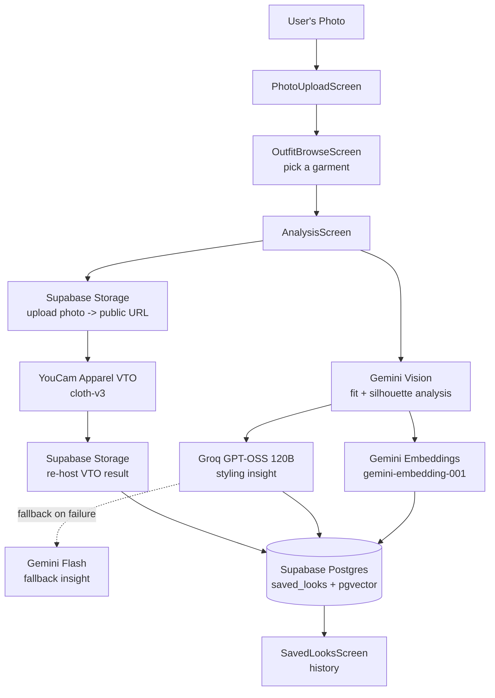
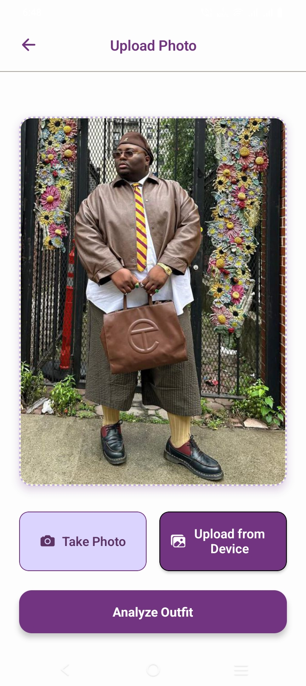
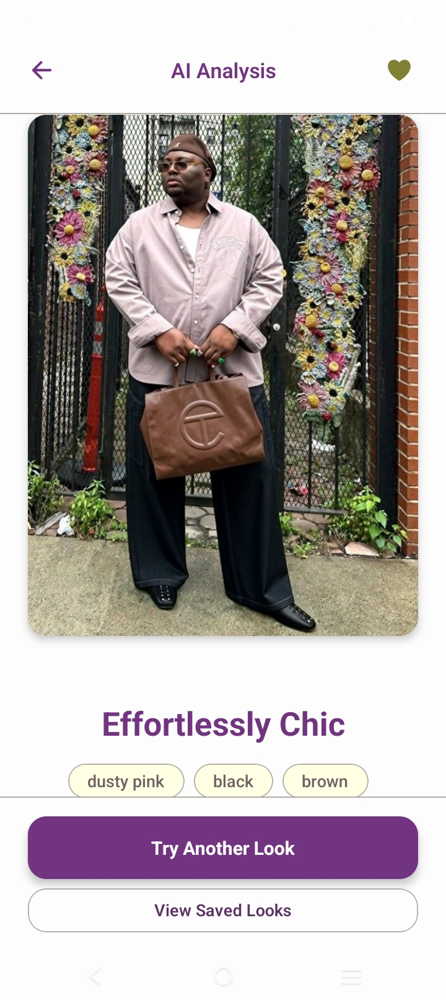
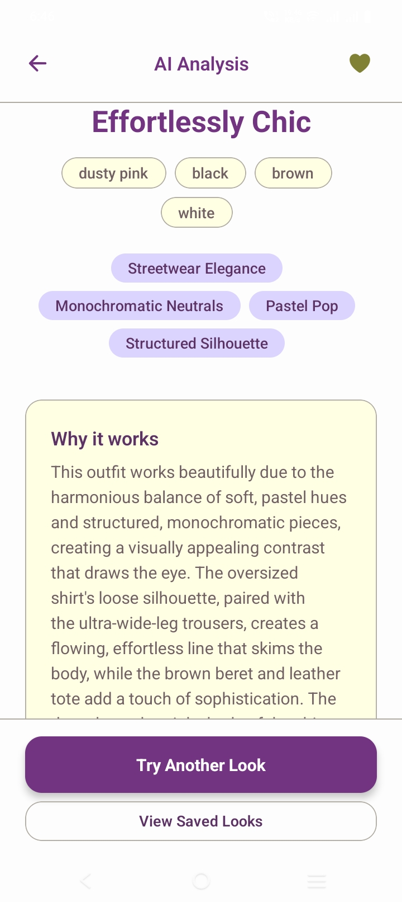
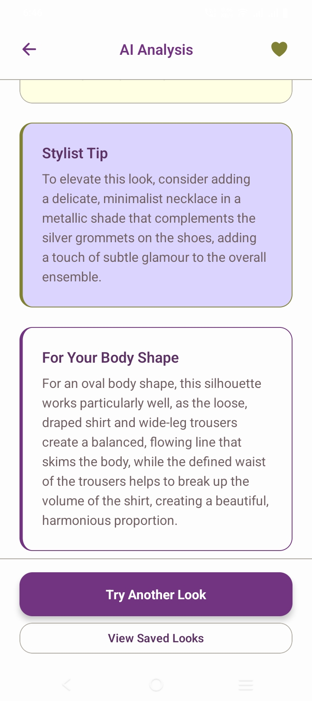

# FashionU


AI-powered styling decision assistant — built for the YouCam API
Skin AI & Apparel VTO Hackathon.

FashionU helps people compare outfit options with AI-generated styling
insight, not just a try-on render. Upload a photo, try on outfits via
YouCam's virtual try-on, and get positive, confidence-framed styling
advice tailored to your self-reported body shape and occasion.

> Youtube Video Link:

## Demo Video

## Tech stack

- **Framework**: Expo (SDK 54), Expo Router, TypeScript (strict mode)
- **State**: React state + AsyncStorage (no auth — hackathon MVP scope)
- **Backend**: Supabase (Postgres + pgvector for semantic similarity)
- **AI**:
  - Gemini (`gemini-3.5-flash`) — outfit image analysis, extracts
    fit/silhouette specifics (neckline, waist, sleeve, cut) for
    body-shape-specific styling advice
  - Gemini (`gemini-embedding-001`) — text embeddings for similarity search
  - Groq (`openai/gpt-oss-120b`) — styling insight generation, with
    Gemini fallback
  - All Gemini/Groq calls retry with exponential backoff on transient
    429/503 errors (`src/shared/utils/retry.ts`)
- **Virtual Try-On**: YouCam API (Perfect Corp) — Apparel VTO

## Architecture



## Getting started

### Prerequisites

- Node.js 18+
- Expo Go app (for testing on device) or an Android/iOS simulator

### Setup

```console
npm install
```

Create a `.env` file with:

```ini
EXPO_PUBLIC_YOUCAM_API_KEY=your-api-key
EXPO_PUBLIC_YOUCAM_SECRET_KEY=your-secret-key
EXPO_PUBLIC_SUPABASE_URL=your-url
EXPO_PUBLIC_SUPABASE_ANON_KEY=your-anon-key
EXPO_PUBLIC_GEMINI_API_KEY=your-key
EXPO_PUBLIC_EMBEDDING_MODEL=gemini-embedding-001
EXPO_PUBLIC_GROQ_API_KEY=your-groq-key
```

Run the Supabase migrations in `supabase/migrations/` (or the SQL
editor, in order).

Before running the application for the first time, you must apply the database migrations:

1. Ensure the Supabase CLI is installed and your local stack is running:

```console
supabase start
```

2. Run the migrations to build your schema:

```console
supabase db reset
```

### Run

```console
npx expo start -c
```

Scan the QR code with Expo Go, or press `a`/`i` for a simulator.

### Test API clients standalone (without the RN app)

```console
npx tsx src/shared/api/test-apis.ts
```

Useful for isolating third-party API issues (auth, endpoint, payload
shape) from React Native environment quirks.

## Product principles

- Body shape is always self-reported (short quiz), never inferred from
  photos — proportion-based categories only (hourglass, rectangle,
  triangle/pear, inverted triangle, oval), no size/weight language.
- All styling copy is positive and confidence-framed.
- The styling-insight comparison screen is the core product
  differentiator — prioritized over catalogue breadth.

## Project structure

```
src/
  app/                    Expo Router thin stubs
    saved-looks.tsx
    outfit-browse.tsx
  features/
    landing/              LandingScreen.tsx
    body-shape-quiz/      BodyShapeQuizScreen.tsx
    occasion-selection/   OccasionSelectionScreen.tsx
    photo-upload/         PhotoUploadScreen.tsx
    outfit-browse/        OutfitBrowseScreen.tsx
    analysis/             AnalysisScreen.tsx
    saved/                SavedLooksScreen.tsx
  shared/
    api/
      gemini.ts            Vision analysis + embeddings
      groq.ts               Styling insight generation + fallback
      supabase.ts           DB client, saveLook(), storage helpers
      youcam.ts              Apparel VTO client
    components/
      ScreenHeader.tsx       Shared safe-area header
    utils/
      retry.ts                Exponential backoff for 429/503
  constants/
    theme.ts               Design tokens (colors, spacing, fonts)
    garments.ts             GARMENT_CATALOGUE
  services/
    aiService.ts             Orchestrates the AI pipeline
supabase/
  migrations/               SQL migrations (schema, RLS)
```

See `AGENTS.md` for the full data model, build conventions, and known
gotchas — it's kept up to date as the source of truth for both human
and AI contributors on this project.

## Screenshots

|                                                               |                                                               |
| ------------------------------------------------------------- | ------------------------------------------------------------- |
|      |           |
|  |  |

## License

MIT.
